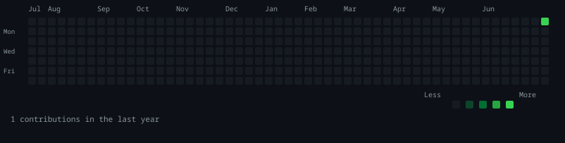
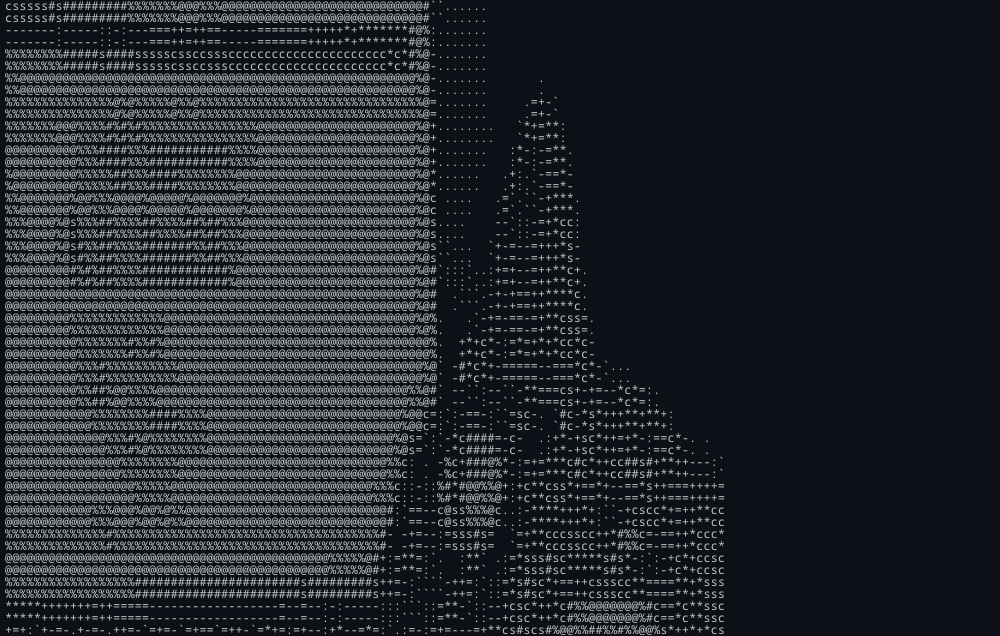
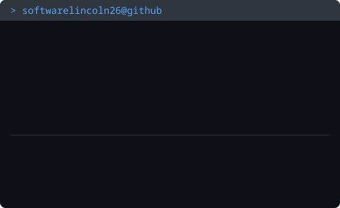

<div align="center">

## `softwarelincoln26@github ~ $ ./contributions.sh`



<br><br>

## `softwarelincoln26@github ~ $ whoami`

<table>
<tr>
<td valign="top"></td>
<td valign="top"></td>
</tr>
</table>

</div>

---

### About Me

I'm a middle school student passionate about cybersecurity, hardware hacking, and building things that matter.

### Current Projects

- **ESP32 Security Tools** - WiFi scanners, deauth detectors, network monitors
- **Jarvis AI** - Voice-activated assistant with screen capture and command execution
- **Cybersecurity Learning** - TryHackMe, network scanning, penetration testing

### Skills

```
Python | C/C++ | JavaScript | Linux | ESP32 | Arduino | Network Security
```

### Hardware Lab

- ESP32-S3-DevKitC-1
- ELEGOO UNO R3 Starter Kit
- Soldering Station
- Multimeter

---

<div align="center">


</div>
